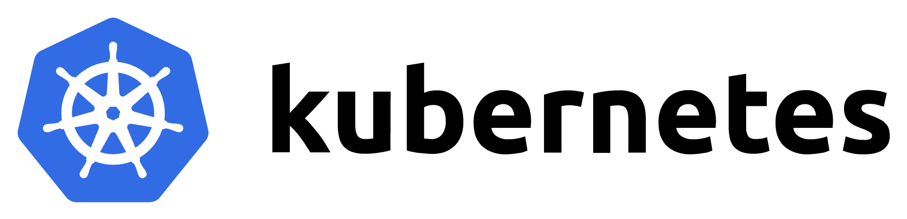

# Steadybit extension-kubernetes

A [Steadybit](https://www.steadybit.com/) extension implementation for Kubernetes.

Learn about the capabilities of this extension in our [Reliability Hub](https://hub.steadybit.com/extension/com.steadybit.extension_kubernetes).

## Configuration

| Environment Variable                                             | Helm value                                                               | Meaning                                                                                                                                                            | required | default                                                              |
|------------------------------------------------------------------|--------------------------------------------------------------------------|--------------------------------------------------------------------------------------------------------------------------------------------------------------------|----------|----------------------------------------------------------------------|
| `STEADYBIT_EXTENSION_KUBERNETES_CLUSTER_NAME`                    | `kubernetes.clusterName`                                                 | The name of the kubernetes cluster                                                                                                                                 | yes      |                                                                      |
| `STEADYBIT_EXTENSION_DISABLE_DISCOVERY_EXCLUDES`                 | `discovery.disableExcludes`                                              | Ignore discovery excludes specified by `steadybit.com/discovery-disabled`                                                                                          | false    | `false`                                                              |
| `STEADYBIT_EXTENSION_LABEL_FILTER`                               |                                                                          | These labels will be ignored and not added to the discovered targets                                                                                               | false    | `controller-revision-hash,pod-template-generation,pod-template-hash` |
| `STEADYBIT_EXTENSION_ACTIVE_ADVICE_LIST`                         | `advice.enabled`                                                         | List of active advice definitions, default is all (*). You can define a list of active adviceDefinitionId. See UI -> Settings -> Extension -> Advice -> Column: ID | false    | `*`                                                                  |
| `STEADYBIT_EXTENSION_ADVICE_EXCLUDE_QUERY`                       | `advice.excludeTargetQuery`                                              |                                                                                                                                                                    | false    | `*`                                                                  |
| `STEADYBIT_EXTENSION_ADVICE_SINGLE_REPLICA_MIN_REPLICAS`         | All targets matching this query will be excluded from advice generation. | Minimal required replicas for the "Redundant Pod" advice                                                                                                           | false    | 2                                                                    |
| `STEADYBIT_EXTENSION_DISCOVERY_ATTRIBUTES_EXCLUDES_CONTAINER`    | `discovery.attributes.excludes.container`                                | List of Target Attributes which will be excluded during container discovery. Checked by key equality and supporting trailing "*"                                   | false    |                                                                      |
| `STEADYBIT_EXTENSION_DISCOVERY_ATTRIBUTES_EXCLUDES_DEPLOYMENT`   | `discovery.attributes.excludes.deployment`                               | List of Target Attributes which will be excluded during deployment discovery. Checked by key equality and supporting trailing "*"                                  | false    |                                                                      |
| `STEADYBIT_EXTENSION_DISCOVERY_ATTRIBUTES_EXCLUDES_DAEMON_SET`   | `discovery.attributes.excludes.daemonSet`                                | List of Target Attributes which will be excluded during daemonSet discovery. Checked by key equality and supporting trailing "*"                                   | false    |                                                                      |
| `STEADYBIT_EXTENSION_DISCOVERY_ATTRIBUTES_EXCLUDES_STATEFUL_SET` | `discovery.attributes.excludes.statefulSet`                              | List of Target Attributes which will be excluded during statefulSet discovery. Checked by key equality and supporting trailing "*"                                 | false    |                                                                      |
| `STEADYBIT_EXTENSION_DISCOVERY_ATTRIBUTES_EXCLUDES_POD`          | `discovery.attributes.excludes.pod`                                      | List of Target Attributes which will be excluded during pod discovery. Checked by key equality and supporting trailing "*"                                         | false    |                                                                      |
| `STEADYBIT_EXTENSION_DISCOVERY_ATTRIBUTES_EXCLUDES_ARGO_ROLLOUT` | `discovery.attributes.excludes.argoRollout`                              | List of Target Attributes which will be excluded during Argo Rollout discovery. Checked by key equality and supporting trailing "*"                               | false    |                                                                      |
| `STEADYBIT_EXTENSION_DISCOVERY_DISABLED_ARGO_ROLLOUT`           | `discovery.disabled.argoRollout`                                          | Disable discovery of Argo rollouts                                                                                                                                 | false    | `true`                                                               |
| `STEADYBIT_EXTENSION_DISCOVERY_ATTRIBUTES_EXCLUDES_ENVOY_GATEWAY` | `discovery.attributes.excludes.envoyGateway`                            | List of Target Attributes which will be excluded during Envoy Gateway HTTP route discovery. Checked by key equality and supporting trailing "*"                    | false    |                                                                      |
| `STEADYBIT_EXTENSION_DISCOVERY_DISABLED_ENVOY_GATEWAY`          | `discovery.disabled.envoyGateway`                                         | Disable discovery of Envoy Gateway HTTP routes and the related attacks (see [Envoy Gateway support](#envoy-gateway-support))                                       | false    | `true`                                                               |
| `STEADYBIT_EXTENSION_DISCOVERY_DISABLED_REPLICA_SET`             | `discovery.disabled.replicaSet`                                          | Disables discovery of ReplicaSets in favor of discovering Deployments, StatefulSets, DaemonSets, etc.                                                              | false    | `true`                                                               |
| `STEADYBIT_EXTENSION_DISCOVERY_MAX_POD_COUNT`                    | `discovery.maxPodCount`                                                  | Skip listing pods, containers and hosts for deployments, statefulsets, etc. if there are more then the given pods.                                                 | false    | 50                                                                   |
| `STEADYBIT_EXTENSION_DISCOVERY_REFRESH_THROTTLE`                 | `discovery.refreshThrottle`                                              | Number of seconds between successive refreshes of the target data.                                                                                                 | false    | 20                                                                   |
| `STEADYBIT_EXTENSION_DISCOVERY_INFORMER_RESYNC`                  |                                                                          | Number of seconds until a full refresh of the internal kubernetes cache.                                                                                           | false    | 600                                                                  |
| `STEADYBIT_EXTENSION_NAMESPACE`                                  | `Release.Namespace`                                                      | The namespace of the extension. If env var is set, discovery is only discovering in that namespace                                                                 | false    | `default`                                                            |

The extension supports all environment variables provided by [steadybit/extension-kit](https://github.com/steadybit/extension-kit#environment-variables).

## Permissions

The process requires access rights to interact with the Kubernetes
API ([permissions in helm chart](/charts/steadybit-extension-kubernetes/templates/_permissions.tpl)).

The cluster role for the extension requires "read" permissions for different kind of workloads in the cluster.
If the permission is not granted to a specific resource type, those will not be discovered and cannot be attacked.

To run the different attacks "write" permissions are required:

- Scale Deployment/StatefulSet/DaemonSet: `update`, `patch` on the workload type
- Rollout Restart Deployment: `patch` on `deployment`
- Delete Pod Attack: `delete` on `pod`
- Crash Loop Pod: `create` on `pod/exec` also needs to have an `sh` and `kill` binary in the target container
- Envoy Gateway HTTP Route attacks: `create`, `delete` on `gateway.envoyproxy.io/backendtrafficpolicies` (see [Envoy Gateway support](#envoy-gateway-support))

## Envoy Gateway support

Discovery of [Envoy Gateway](https://gateway.envoyproxy.io/) HTTP routes and the related attacks — *Envoy Delay Traffic* and *Envoy Abort Traffic* (which can optionally overwrite the response body) — are **opt-in and disabled by default**. Enable them with `discovery.disabled.envoyGateway=false` (`STEADYBIT_EXTENSION_DISCOVERY_DISABLED_ENVOY_GATEWAY=false`).

When enabled, the extension discovers `HTTPRoute`s whose parent `Gateway` belongs to a `GatewayClass` managed by Envoy Gateway (controller `gateway.envoyproxy.io/gatewayclass-controller`). Each attack applies an Envoy Gateway `BackendTrafficPolicy` to the targeted `HTTPRoute` for the duration of the attack and removes it afterwards. The corresponding RBAC (`read` on `gateway.networking.k8s.io` httproutes/gateways/gatewayclasses and full access to `gateway.envoyproxy.io/backendtrafficpolicies`) is granted automatically only when the feature is enabled.

> **Minimum Envoy Gateway version: `v1.3.0`.**
> The *Envoy Delay Traffic* attack works on any Envoy Gateway release with `BackendTrafficPolicy` fault injection. The *Envoy Abort Traffic* attack requires **Envoy Gateway `v1.3.0` or later**: it uses the `BackendTrafficPolicy` `responseOverride` feature (response `statusCode` override) so it can return a clean response body instead of Envoy's built-in `fault filter abort` body. `v1.3.0` is the version the extension is tested against.

> **Note:** Envoy Gateway support requires cluster-scoped access (GatewayClasses are cluster-scoped), so it is not available when the extension is restricted to a single namespace via `STEADYBIT_EXTENSION_NAMESPACE`.

## Installation

### Kubernetes

Detailed information about agent and extension installation in kubernetes can also be found in
our [documentation](https://docs.steadybit.com/install-and-configure/install-agent/install-on-kubernetes).

#### Recommended (via agent helm chart)

All extensions provide a helm chart that is also integrated in the
[helm-chart](https://github.com/steadybit/helm-charts/tree/main/charts/steadybit-agent) of the agent.

The extension is installed by default when you install the agent.

You must provide additional values to configure this extension.

```
--set extension-kubernetes.kubernetes.clusterName=<NAME_OF_YOUR_CLUSTER> \
```

Additional configuration options can be found in
the [helm-chart](https://github.com/steadybit/extension-kubernetes/blob/main/charts/steadybit-extension-kubernetes/values.yaml) of the
extension.

#### Alternative (via own helm chart)

If you need more control, you can install the extension via its
dedicated [helm-chart](https://github.com/steadybit/extension-kubernetes/blob/main/charts/steadybit-extension-kubernetes).

```bash
helm repo add steadybit-extension-kubernetes https://steadybit.github.io/extension-kubernetes
helm repo update
helm upgrade steadybit-extension-kubernetes \
  --install \
  --wait \
  --timeout 5m0s \
  --create-namespace \
  --namespace steadybit-agent \
  --set kubernetes.clusterName=<NAME_OF_YOUR_CLUSTER> \
  steadybit-extension-kubernetes/steadybit-extension-kubernetes
```

## Advanced Configuration

### Enabling/disabling advice

You can disable any advice by setting the helm chart value `--set advice.enabled={}` or a list of advice ids you want to enable (e.g `--set advice.enabled={com.steadybit.extension_kubernetes.advice.k8s-single-replica,com.steadybit.extension_kubernetes.advice.single-zone}`).

### Excluding targets from advice generation

You can exclude targets from advice generation by specifying a target query in the chart value `advice.excludeTargetQuery`.
For example, to exclude all targets in the "kube-system" namespace you can set the value to `"k8s.namespace = \"kube-system\""`.

## Extension registration

Make sure that the extension is registered with the agent. In most cases this is done automatically. Please refer to
the [documentation](https://docs.steadybit.com/install-and-configure/install-agent/extension-registration) for more
information about extension registration and how to verify.

## Mark resources as "do not discover"

to exclude a deployment / namespace / pod from discovery you can add the label `"steadybit.com/discovery-disabled": "true"` to the resource labels

## Version and Revision

The version and revision of the extension:

- are printed during the startup of the extension
- are added as a Docker label to the image
- are available via the `version.txt`/`revision.txt` files in the root of the image
